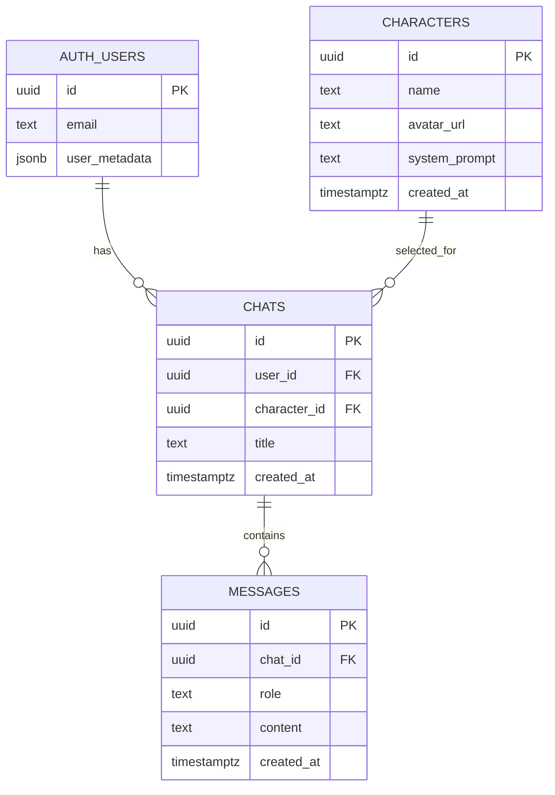

# AI Chat App -- Database Setup & Diagrams

This directory contains all database-related SQL files and architectural
diagrams used in the AI Chat Application case study.

The goal of this setup is to provide a **secure, scalable, and
production-ready** data model that supports: - Multiple AI characters -
Persistent chat sessions - Message history with streaming AI responses -
Proper row-level security (RLS)

---

## Directory Overview

### SQL Files

- **`extension.sql`**\
  Enables required PostgreSQL extensions (e.g. `pgcrypto`) for UUID
  generation.

- **`characters.sql`**\
  Creates the `public.characters` table and its Row Level Security
  (RLS) policies.\
  This table stores predefined AI personas (name, avatar, system
  prompt).

- **`chats.sql`**\
  Creates the `public.chats` table and RLS policies.\
  Each chat represents a session between a user and a selected AI
  character.

- **`messages.sql`**\
  Creates the `public.messages` table and RLS policies.\
  Stores all user and AI messages for a given chat.

- **`indexes.sql`**\
  Adds performance-related indexes, mainly for efficient message
  retrieval.

- **`seed_characters.sql`**\
  Inserts initial predefined AI characters into the database.

---

### Diagrams

- **`flow.mermaid`**\
  Application flow diagram showing authentication, character
  selection, chat creation, message streaming, and persistence.

- **`db.mermaid`**\
  Entity Relationship Diagram (ERD) describing database tables and
  their relationships.

---

## Database Setup (Execution Order)

> **Where to run these files:**\
> Supabase Dashboard → **SQL Editor** → _New query_

Run the following files **in order**:

### 1️⃣ Enable Extensions

    extension.sql

### 2️⃣ Create Tables & RLS Policies

    characters.sql
    chats.sql
    messages.sql

### 3️⃣ Create Indexes

    indexes.sql

### 4️⃣ Seed Initial Data

    seed_characters.sql

✅ After completing these steps, you should see: - `public.characters`
populated with predefined AI characters - Empty `public.chats` and
`public.messages` tables - RLS enabled on all tables

---

## Application Flow Diagram (`flow.mermaid`)

```mermaid
flowchart TD
    U[User] -->|Google OAuth| A[Supabase Auth]
    A -->|Session| APP[Next.js App]

    APP --> CSEL[Character Selection]
    CSEL -->|Select Character| CHATCREATE[Create Chat Session]

    CHATCREATE --> DBCHATS[(chats)]
    DBCHATS --> CHATUI[Chat UI]

    CHATUI -->|User Message| DBMSG[(messages)]
    CHATUI -->|Send Prompt| LLM[LLM API<br/>(OpenAI / Groq)]

    LLM -->|Streaming Response| CHATUI
    CHATUI -->|Persist AI Message| DBMSG

    DBCHATS --> SIDEBAR[Chat History Sidebar]
    DBMSG --> CHATUI

    subgraph Database
        DBCHATS
        DBMSG
        DBCHAR[(characters)]
    end

    DBCHAR --> CHATCREATE
```

---

## Database Schema Diagram (`db.mermaid`)



---

## Notes & Design Decisions

### Row Level Security (RLS)

- Users can only read, insert, update, and delete **their own chats
  and messages**.
- The `characters` table is **read-only** and accessible to all
  authenticated users.

### Message Role

- `messages.role` can be:
  - `user` → message sent by the user
  - `assistant` → message generated by the AI
- This field is used by the UI to determine message alignment and
  styling.

### Why Characters Are Stored in the Database

- Enables easy addition or modification of AI personas
- Allows different system prompts per chat
- Demonstrates scalable and product-oriented thinking

---

## Viewing Mermaid Diagrams

You can visualize the Mermaid diagrams using: - **Mermaid Live
Editor** - VS Code extensions such as **"Markdown Preview Mermaid
Support"** - GitHub (Mermaid is supported in Markdown previews)

---

## Outcome

This setup provides: - A secure, scalable chat persistence layer - Clear
separation of concerns (users, chats, messages, characters) - A strong
foundation for streaming AI responses and chat history

This structure is intentionally designed to reflect **senior-level
architectural decisions**.
